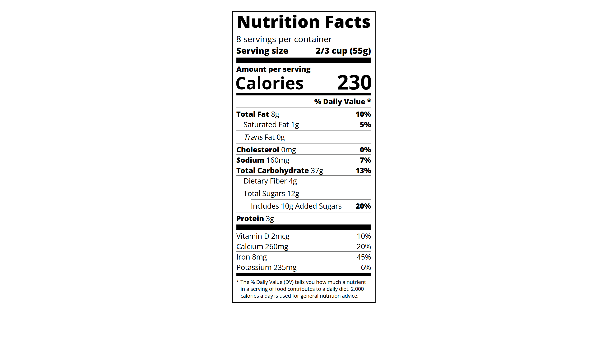

# Nutrition Label

A clean and semantic nutrition label built using **HTML** and **CSS**, showcasing structured layout and typography.

## Features

- Semantic HTML elements  
- Accurate layout resembling real-world food labels  
- Styled with custom fonts and spacing  
- Responsive to different screen sizes

## Preview

## How to Use

1. Clone or download the project  
2. Open `index.html` in your browser  
3. View the nutrition label structure and styling

## Project Link

[Build a Nutrition Label - freeCodeCamp](https://www.freecodecamp.org/learn/2022/responsive-web-design/learn-typography-by-building-a-nutrition-label/step-1)
